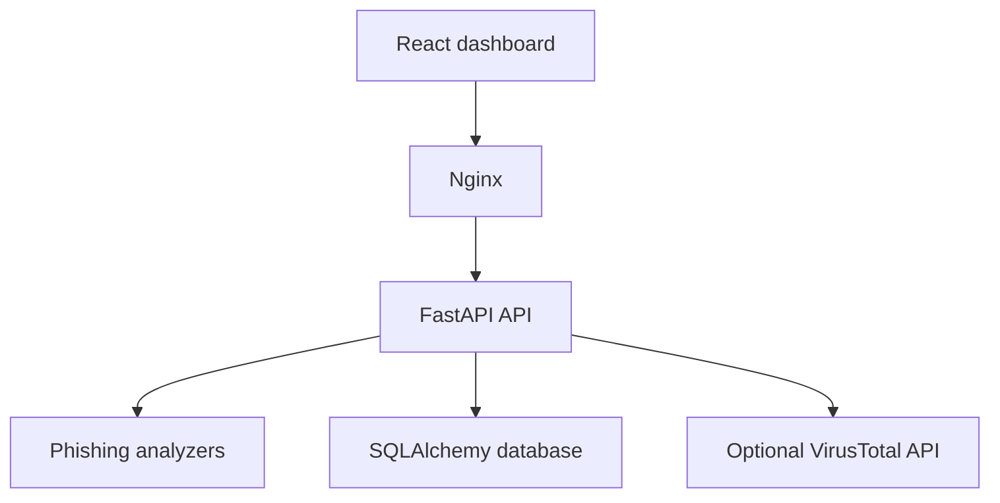

# PhishTriage

[](https://github.com/karmeensec/phishtriage/actions/workflows/ci.yml)
[](https://phishtriage.onrender.com/)
[](https://www.python.org/)
[](https://react.dev/)

A secure phishing-email analysis and incident-triage platform built with FastAPI, React, SQLAlchemy, and Docker.

PhishTriage accepts `.eml` files, analyzes them without opening links or executing attachments, calculates an explainable risk score, and presents the evidence through an analyst-focused dashboard.

## Live Demo

* **Dashboard:** https://phishtriage.onrender.com/
* **API health:** https://phishtriage-api.onrender.com/api/v1/health
* **API documentation:** https://phishtriage-api.onrender.com/docs

The public deployment runs in privacy mode. Uploaded emails are analyzed temporarily and are not retained. Analysis history is disabled to prevent visitors from viewing one another's email metadata.

The free hosting service can take approximately 30-60 seconds to wake after a period of inactivity.

## Features

* Secure `.eml` upload and validation
* Explainable risk scoring from 0-100
* Low, medium, high, and critical classifications
* SPF, DKIM, and DMARC result analysis
* Sender, Reply-To, Return-Path, and link-domain mismatch detection
* Microsoft Spam Confidence Level detection
* HTTP, IP-address, embedded-credential, Punycode, and malformed URL detection
* Optional VirusTotal domain-reputation analysis
* Dangerous and double-extension attachment detection
* Urgency, credential, account-threat, action-prompt, and financial-lure analysis
* Invisible Unicode text-obfuscation detection
* Paginated analysis history for private deployments
* Search and filtering for saved investigations
* Selectable saved investigation reports
* SHA-256 email and attachment fingerprinting
* JSON and PDF report downloads
* Public-demo privacy mode
* Environment-based production CORS
* API upload rate limiting
* Security headers and per-request identifiers
* Automated backend and frontend tests
* GitHub Actions continuous integration
* Dockerized development and demonstration environment

## Architecture



The core analyzer operates without visiting extracted links or executing attachment content. When URL reputation is enabled, extracted domains can be submitted to VirusTotal for reputation data.

## Detection Categories

### Header analysis

* Sender and Reply-To domain mismatch
* Sender and Return-Path domain mismatch
* Sender and link-domain mismatch
* SPF failure or error
* DKIM failure or error
* DMARC failure or unverified result
* Elevated Microsoft Spam Confidence Level

### URL analysis

* Unencrypted HTTP links
* IP-address URLs
* Embedded usernames or passwords
* Punycode domains
* Malformed URLs
* Optional external domain-reputation findings

### Attachment analysis

* Dangerous executable extensions
* Misleading double extensions
* Attachment metadata and SHA-256 fingerprints

Attachments are inspected only as bounded bytes for metadata and hashing. They are never opened or executed.

### Body analysis

* Urgent or pressuring language
* Account suspension threats
* Credential requests
* Sensitive financial actions
* Action prompts
* Cryptocurrency and financial lures
* Invisible Unicode characters used to evade detection

## Explainable Risk Scoring

Every finding includes:

* Rule identifier
* Human-readable title
* Severity
* Score contribution
* Supporting evidence

The total public score is capped at `100`.

|  Score | Risk level |
| -----: | ---------- |
|   0-19 | Low        |
|  20-39 | Medium     |
|  40-69 | High       |
| 70-100 | Critical   |

PhishTriage is rule-based. A low score means that the message did not trigger the currently implemented rules; it does not guarantee that the email is safe.

## Quick Start with Docker

### Requirements

* Docker Desktop
* Docker Compose

From the repository root:

```powershell
docker compose up --build
```

Open:

* Dashboard: `http://127.0.0.1:5173`
* API documentation: `http://127.0.0.1:8000/docs`
* Health endpoint: `http://127.0.0.1:8000/api/v1/health`

Stop the application:

```powershell
docker compose down
```

The Docker configuration runs database migrations automatically before starting the API.

## Manual Development Setup

### Backend

Create and activate a virtual environment:

```powershell
python -m venv .venv
Set-ExecutionPolicy -Scope Process -ExecutionPolicy RemoteSigned
.\.venv\Scripts\Activate.ps1
```

Install the dependencies:

```powershell
python -m pip install --upgrade pip
python -m pip install -r backend\requirements-dev.txt
```

Apply database migrations:

```powershell
python -m alembic upgrade head
```

Start FastAPI:

```powershell
python -m uvicorn backend.app.main:app --reload
```

### Frontend

In another terminal:

```powershell
cd frontend
npm install
npm run dev
```

Open `http://127.0.0.1:5173`.

## API Endpoints

| Method | Endpoint                         | Purpose                             |
| ------ | -------------------------------- | ----------------------------------- |
| `GET`  | `/api/v1/health`                 | Check API availability              |
| `POST` | `/api/v1/analyze`                | Analyze an uploaded `.eml` file     |
| `GET`  | `/api/v1/analyses`               | List saved analyses with pagination |
| `GET`  | `/api/v1/analyses/{analysis_id}` | Retrieve a saved investigation      |

Interactive OpenAPI documentation is available at `/docs`.

## Configuration

PhishTriage reads deployment configuration from environment variables.

| Variable                 | Default                | Purpose                                   |
| ------------------------ | ---------------------- | ----------------------------------------- |
| `DATABASE_URL`           | Local SQLite database  | SQLAlchemy database connection            |
| `PUBLIC_DEMO_MODE`       | `false`                | Disables persistence and shared history   |
| `ALLOWED_ORIGINS`        | Local frontend origins | Permitted CORS origins                    |
| `URL_REPUTATION_ENABLED` | `false`                | Enables external domain-reputation checks |
| `VIRUSTOTAL_API_KEY`     | None                   | VirusTotal API credential                 |

Do not place API keys in source code, `.env` files committed to Git, screenshots, or documentation.

For a public demonstration deployment, enable:

```text
PUBLIC_DEMO_MODE=true
```

In public-demo mode:

* Uploaded emails are analyzed temporarily
* New analyses are not saved
* Shared history is disabled
* Saved-report endpoints are unavailable
* The dashboard displays a privacy notice

## Security and Privacy

PhishTriage applies defensive controls when handling untrusted email files:

* Only `.eml` files are accepted
* Upload size is limited to 2 MB
* Client filenames containing path components are rejected
* Extracted URLs are rendered as non-clickable evidence
* Attachments are never opened or executed
* Raw email content is not retained in the database
* Stored records contain selected metadata, findings, and fingerprints
* Database timestamps are normalized to UTC
* Public-demo mode prevents access to shared analysis history
* API responses exclude unnecessary raw message content
* API requests receive unique request identifiers
* Security headers restrict browser behavior
* Upload rate limiting reduces automated abuse
* Production CORS restricts permitted frontend origins
* External API credentials remain server-side

When VirusTotal integration is enabled, extracted domains may be shared with VirusTotal for reputation analysis. Disable the integration when analyzing sensitive or confidential infrastructure.

Real phishing samples may contain personal information, active tracking links, or dangerous attachments. They should never be committed to the repository.

## Testing

Run the backend test suite:

```powershell
python -m pytest -q
```

Run frontend tests, linting, and the production build:

```powershell
cd frontend
npm test -- --run
npm run lint
npm run build
```

GitHub Actions automatically performs these checks for pushes and pull requests targeting `main`.

## Project Structure

```text
phishtriage/
|-- .github/
|   `-- workflows/
|       `-- ci.yml
|-- backend/
|   |-- app/
|   |   |-- analyzers/
|   |   |-- api/
|   |   |-- middleware/
|   |   |-- services/
|   |   |-- config.py
|   |   |-- database.py
|   |   |-- models.py
|   |   `-- main.py
|   |-- migrations/
|   |-- tests/
|   |-- Dockerfile
|   |-- requirements.txt
|   `-- requirements-dev.txt
|-- frontend/
|   |-- public/
|   |-- src/
|   |   |-- components/
|   |   `-- services/
|   |-- Dockerfile
|   `-- nginx.conf
|-- compose.yaml
|-- alembic.ini
|-- LICENSE
`-- README.md
```

## Deployment

The public application is deployed as two services:

* A Dockerized FastAPI backend
* A Dockerized React/Nginx frontend

The frontend communicates with the production API through an environment-configured API URL. Render automatically deploys changes pushed to the connected `main` branch after the configured checks complete.

## Limitations

PhishTriage is a defensive, rule-based analysis platform. It is not a replacement for a secure email gateway, malware sandbox, antivirus engine, or professional incident-response process.

Current limitations include:

* No dynamic malware execution or sandbox detonation
* No attachment antivirus scanning
* No machine-learning classification
* Authentication success does not guarantee sender legitimacy
* Reputation results depend on an external provider and available API quota
* SQLite is intended for local or single-instance demonstration use
* Shared analysis history requires authentication before public use
* Rule coverage must be maintained as phishing techniques evolve

## Future Improvements

* Authenticated analyst accounts
* Role-based access control
* PostgreSQL support for multi-user deployments
* Attachment antivirus or sandbox integration
* Additional reputation providers
* Detection-rule management
* Analyst notes and case-status tracking
* Expanded regression corpus with sanitized samples

## Disclaimer

This project is intended for defensive cybersecurity education, analysis, and portfolio demonstration. Do not use it to interact with malicious infrastructure or execute untrusted content.

## License

See the `LICENSE` file for licensing information.
