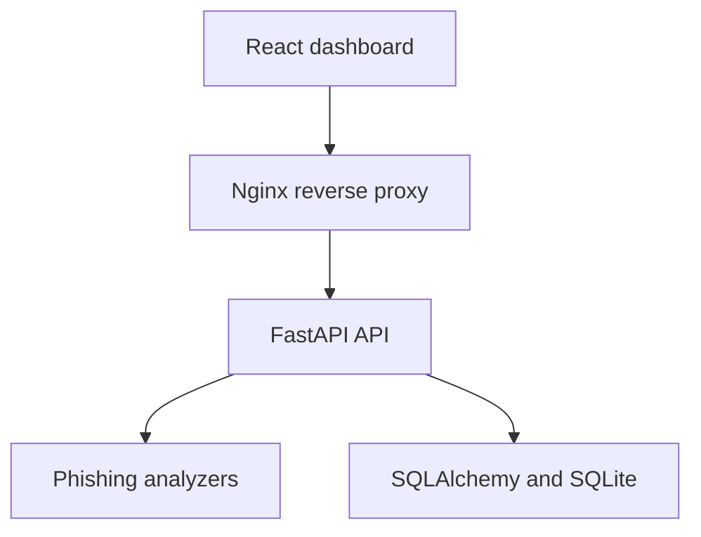

# PhishTriage

A secure phishing-email analysis and incident-triage platform built with FastAPI, React, SQLAlchemy, and Docker.

PhishTriage accepts `.eml` files, analyzes them without opening links or executing attachments, calculates an explainable risk score, and presents the evidence through an analyst-focused dashboard.

## Features

- Secure `.eml` upload and validation
- Explainable risk score from 0–100
- Low, medium, high, and critical classifications
- SPF, DKIM, and DMARC result analysis
- Sender, Reply-To, and Return-Path mismatch detection
- Microsoft Spam Confidence Level detection
- HTTP, IP-address, embedded-credential, and Punycode URL detection
- Dangerous and double-extension attachment detection
- Urgency, credential, account-threat, and financial-lure analysis
- Invisible Unicode text-obfuscation detection
- Paginated analysis history
- Saved investigation detail reports
- SHA-256 email fingerprinting
- Public-demo privacy mode
- Automated backend and frontend tests
- Dockerized development and demonstration environment

## Architecture



The analyzer operates locally and does not visit extracted URLs or execute attachment content.

## Detection Categories

### Header analysis

- Sender and Reply-To domain mismatch
- Sender and Return-Path domain mismatch
- SPF failure or error
- DKIM failure or error
- DMARC failure or unverified result
- Elevated Microsoft Spam Confidence Level

### URL analysis

- Unencrypted HTTP links
- IP-address URLs
- Embedded usernames or passwords
- Punycode domains
- Malformed URLs

### Attachment analysis

- Dangerous executable extensions
- Misleading double extensions
- Attachment metadata and SHA-256 fingerprints

### Body analysis

- Urgent or pressuring language
- Account suspension threats
- Credential requests
- Sensitive financial actions
- Action prompts
- Cryptocurrency and financial lures
- Invisible Unicode characters used to evade detection

## Risk Scoring

Each finding includes:

- Rule identifier
- Human-readable title
- Severity
- Score contribution
- Supporting evidence

The total public score is capped at `100`.

| Score | Risk level |
|---:|---|
| 0–19 | Low |
| 20–39 | Medium |
| 40–69 | High |
| 70–100 | Critical |

## Quick Start with Docker

### Requirements

- Docker Desktop
- Docker Compose

From the repository root:

```powershell
docker compose up --build
```

Open:

- Dashboard: `http://127.0.0.1:5173`
- API documentation: `http://127.0.0.1:8000/docs`
- Health endpoint: `http://127.0.0.1:8000/api/v1/health`

Stop the application:

```powershell
docker compose down
```

The Docker configuration runs database migrations automatically before starting the API.

## Manual Development Setup

### Backend

Create and activate a virtual environment:

```powershell
python -m venv .venv
Set-ExecutionPolicy -Scope Process -ExecutionPolicy RemoteSigned
.\.venv\Scripts\Activate.ps1
```

Install dependencies:

```powershell
python -m pip install --upgrade pip
python -m pip install -r backend\requirements-dev.txt
```

Apply database migrations:

```powershell
python -m alembic upgrade head
```

Start FastAPI:

```powershell
python -m uvicorn backend.app.main:app --reload
```

### Frontend

In another terminal:

```powershell
cd frontend
npm install
npm run dev
```

Open `http://127.0.0.1:5173`.

## API Endpoints

| Method | Endpoint | Purpose |
|---|---|---|
| `GET` | `/api/v1/health` | API health check |
| `POST` | `/api/v1/analyze` | Analyze an uploaded `.eml` file |
| `GET` | `/api/v1/analyses` | List saved analyses with pagination |
| `GET` | `/api/v1/analyses/{analysis_id}` | Retrieve a saved investigation |

Interactive OpenAPI documentation is available at `/docs`.

## Configuration

PhishTriage reads configuration from environment variables.

| Variable | Default | Purpose |
|---|---|---|
| `DATABASE_URL` | Local SQLite database | SQLAlchemy database connection |
| `PUBLIC_DEMO_MODE` | `false` | Disables persistence and shared history when enabled |

For a publicly accessible deployment, use:

```text
PUBLIC_DEMO_MODE=true
```

In public-demo mode:

- Uploaded emails are analyzed temporarily
- New analyses are not saved
- Shared history is disabled
- Saved-report endpoints are unavailable
- The dashboard displays a privacy notice

## Security and Privacy

PhishTriage was designed with defensive handling of untrusted email files:

- Only `.eml` files are accepted
- Upload size is limited to 2 MB
- Client filenames containing path components are rejected
- Extracted URLs are never requested automatically
- URLs are displayed as non-clickable evidence
- Attachments are never opened or executed
- Raw email content is not retained in the database
- Stored records contain selected metadata, findings, and SHA-256 fingerprints
- Database timestamps are normalized to UTC
- Public-demo mode prevents visitors from accessing shared analysis history
- API responses exclude unnecessary raw message content

Real phishing samples may contain personal information, active tracking links, or dangerous attachments. They should never be committed to the repository.

## Testing

Run the backend test suite:

```powershell
python -m pytest -q
```

Run frontend tests, linting, and the production build:

```powershell
cd frontend
npm test -- --run
npm run lint
npm run build
```

## Project Structure

```text
phishtriage/
├── backend/
│   ├── app/
│   │   ├── analyzers/
│   │   ├── api/
│   │   ├── middleware/
│   │   ├── services/
│   │   ├── database.py
│   │   ├── models.py
│   │   └── main.py
│   ├── migrations/
│   ├── tests/
│   ├── Dockerfile
│   └── requirements.txt
├── frontend/
│   ├── src/
│   │   ├── components/
│   │   └── services/
│   ├── Dockerfile
│   └── nginx.conf
├── compose.yaml
├── alembic.ini
└── README.md
```

## Limitations

PhishTriage is a rule-based defensive analysis platform and is not a replacement for a secure email gateway, malware sandbox, or professional incident-response process.

Current limitations include:

- No dynamic malware execution
- No automatic URL reputation lookup
- No attachment antivirus scanning
- No machine-learning classification
- Authentication success does not guarantee that a message is trustworthy
- SQLite is intended for local or single-instance demonstration use
- Shared history requires authentication before it should be enabled publicly

## Future Improvements

- Authenticated analyst accounts
- Role-based access control
- PostgreSQL support
- URL reputation integrations
- Attachment antivirus scanning
- Exportable PDF or JSON investigation reports
- Search and filtering for saved analyses
- CI/CD deployment workflow

## Disclaimer

This project is intended for defensive cybersecurity education, analysis, and portfolio demonstration. Do not use it to interact with malicious infrastructure or execute untrusted content.

## License

See the `LICENSE` file for licensing information.